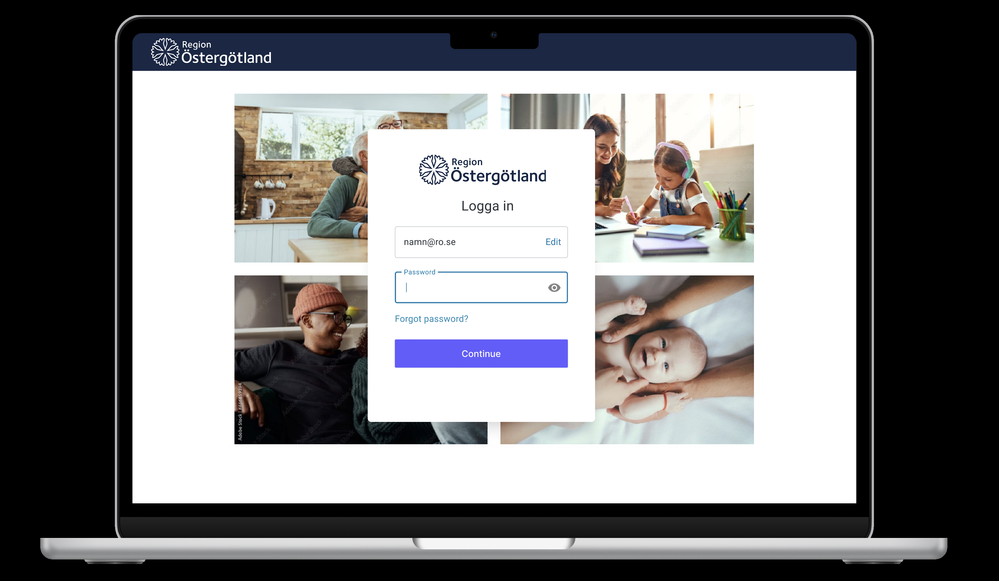
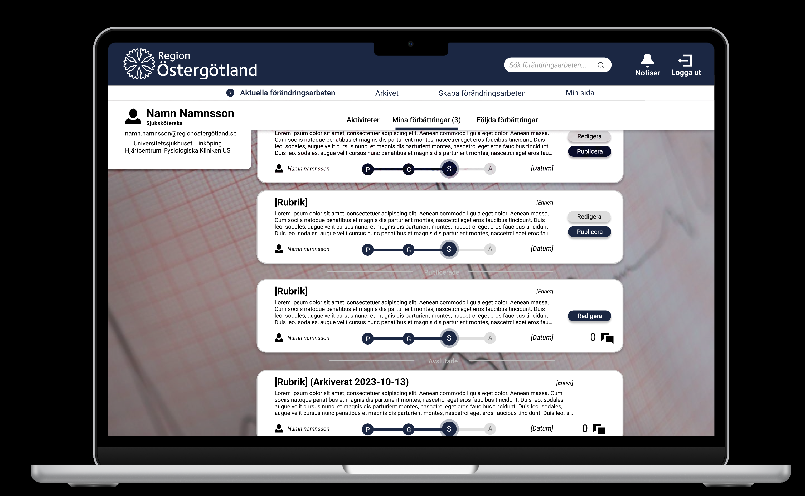
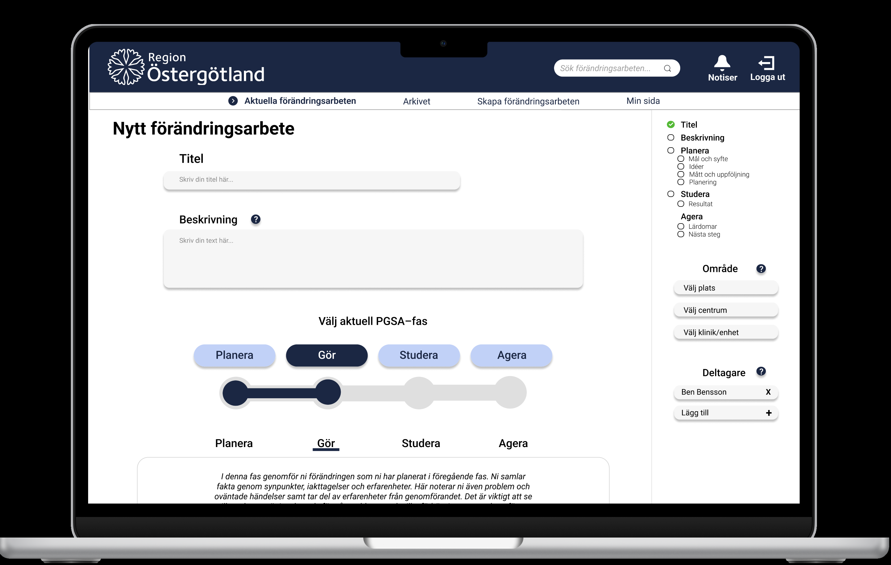
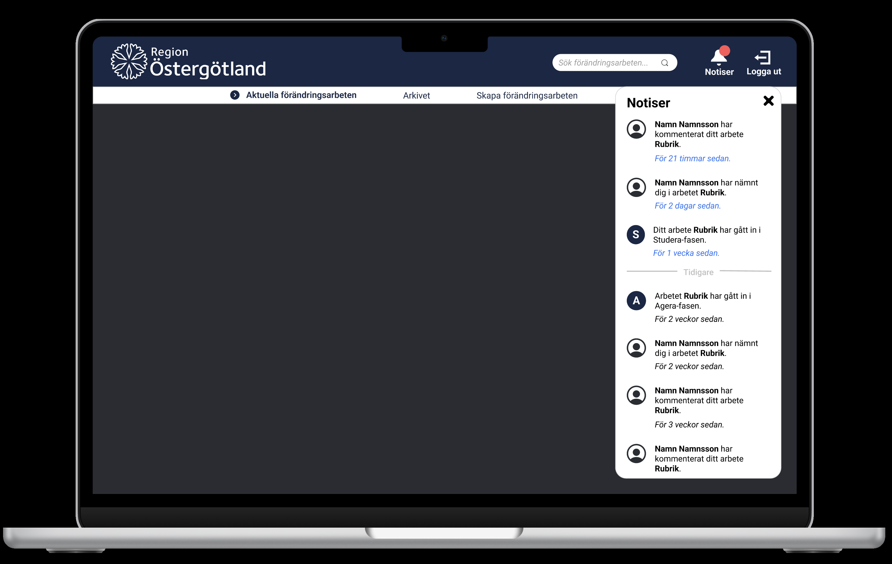
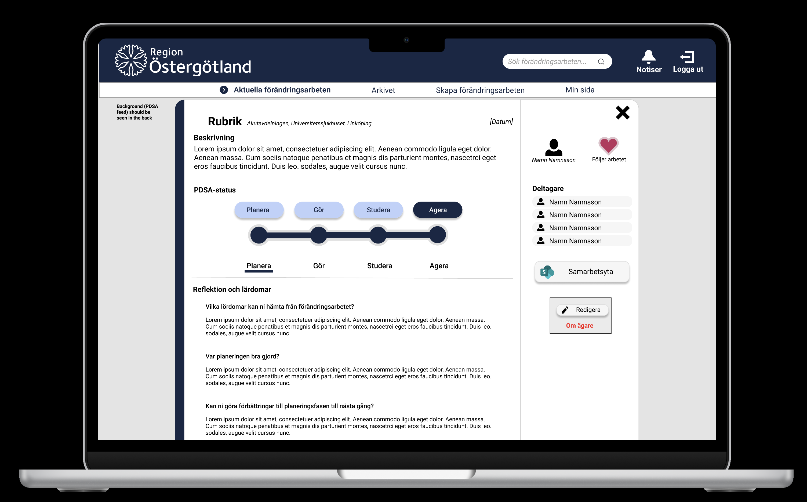
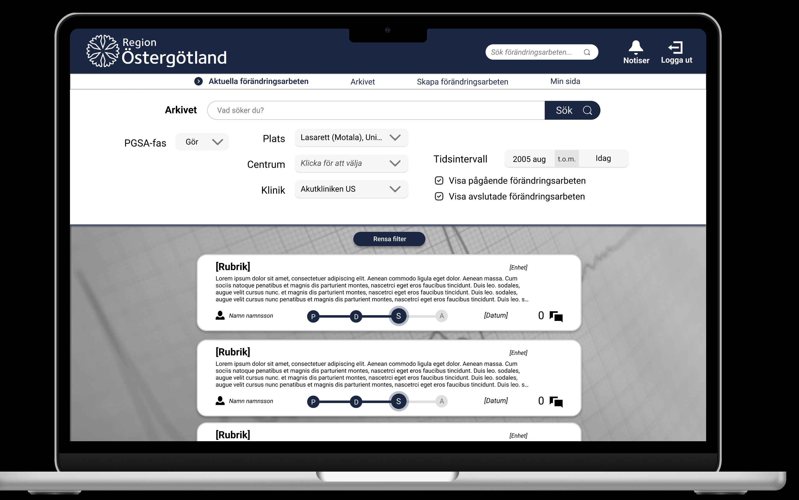
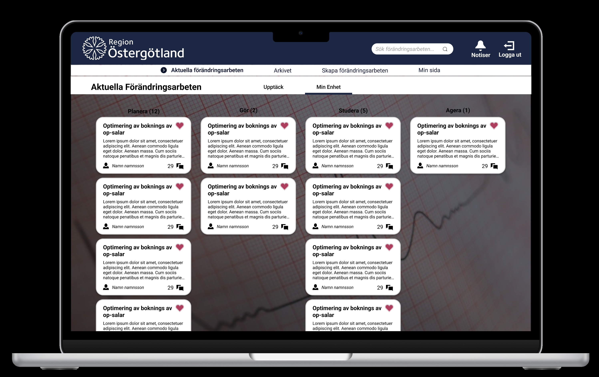

# TDDC88 - Software Engineering

## Overview
This project was developed as part of the TDDC88 course at Linköping University. The course focused on software engineering practices, culminating in the development of a web application for Region Östergötland. The application aims to digitize improvement works, involving around 10 developers, along with management and designers. I served as the Integrator for this project.

## Table of Contents
- [Stack](#stack)
- [Preview](#preview)
- [Getting Started](#getting-started)
- [Setting Up the Database](#setting-up-the-database)
- [Running Tests](#running-tests)
- [Contribution Guidelines](#contribution-guidelines)
- [License](#license)

## Stack
- **Frontend**: Angular
- **Backend**: Python (Django)
- **Database**: SQL
- **Authentication**: Auth0
- **Natural Language Processing**: rake-nltk (Python)

We chose Angular for its powerful front-end capabilities and Django for its robust backend framework. SQL was selected for reliable data storage, while Auth0 provides secure authentication. rake-nltk helps with efficient keyword extraction for our search functionality.

## Preview

*Start view*

*IWs connected to profile*

*Create a new IW*

*Notices*

*Open and read about IW*

*Search with keywords in Swedish and English*

*Unit view*

## Getting Started

### Prerequisites
- Node.js version 18.18.0
- Angular CLI
- Python (with pip)
- Virtual Environment (venv)

## Start up project

To start Django (restAPI):
If you haven't created a virtual environment do that first
1. Go to DjangoAPI folder .\tddc88-company-1-2023\DjangoAPI
2. python -m venv venv
3. Start the virtual environment: .venv\Scripts\activate or source venv/bin/activate
4. While in the virtual environment download the necessary requirements
    - pip install -r requirements.txt (might need to use pip3)

Setup the database:
1. Go to .\tddc88-company-1-2023\DjangoAPI
2. Start your Virtual Environment
3. Write the following commands:
    - python manage.py makemigrations
    - python manage.py migrate
        - If user and Improvment were not part of the migrations
        - python manage.py makemigrations user
        - python manage.py makemigrations Improvment (it is sensitive to caps)
        - python manage.py migrate user
        - python manage.py migrate Improvment (it is sensitive to caps)
    - python manage.py runserver
4. After the database has been made and is running open a **new** terminal and write the following commands:
    - Go to .\tddc88-company-1-2023\DjangoAPI
    - python populatedb.py
        - You will be asked to if you want to wipe the database (yes/no) write yes
        - This should populate the database with all of the improvement works.

To be able to test using pytest
1. Start your virtual environment
2. pip install pytest-django
3. pytest (this will run the tests currently reciding in the tests folder)
